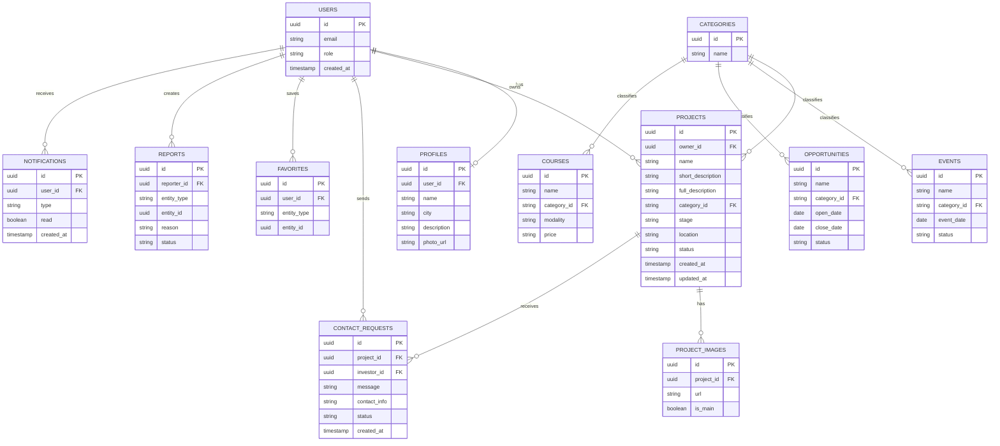
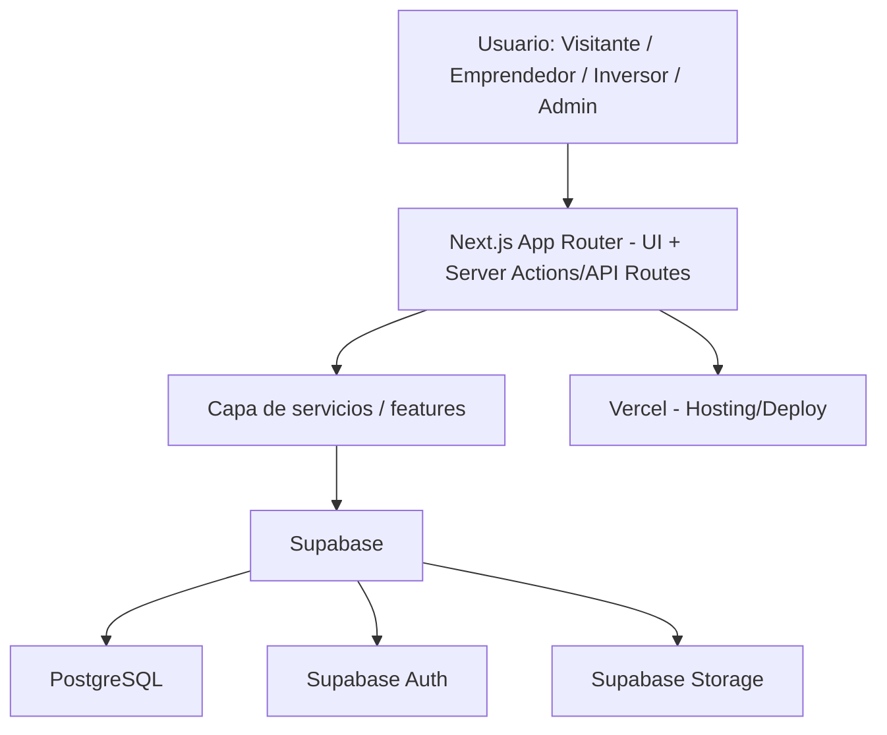

# REQUIREMENTS.md — EmprendeYa (MVP)

**Versión:** 1.0
**Fecha:** 2026
**Tipo de documento:** Requerimientos funcionales, no funcionales, arquitectura y stack tecnológico para el MVP
**Uso previsto:** Fuente principal de verdad para el desarrollo del MVP mediante vibecoding en Cursor

---

## ÍNDICE

1. Resumen ejecutivo
2. Objetivo del MVP e hipótesis a validar
3. Usuarios del sistema
4. Módulos funcionales
5. Base de datos
6. Stack tecnológico
7. Arquitectura
8. Seguridad
9. Requerimientos no funcionales
10. Fuera del alcance del MVP
11. Métricas del MVP
12. Criterio de validación
13. Requerimientos funcionales (RF)
14. Historias de usuario
15. Criterios de aceptación
16. Modelo de datos (con diagrama ER)
17. Arquitectura general (diagrama)
18. Matriz MVP
19. Roadmap futuro
20. Decisiones técnicas documentadas
21. Preguntas abiertas

---

## 1. RESUMEN EJECUTIVO

EmprendeYa es un portal web dirigido inicialmente a emprendedores de Montería y la región. Centraliza tres tipos de oportunidades — **eventos**, **convocatorias** y **cursos** — y permite a los emprendedores publicar sus **proyectos** para ser descubiertos por posibles **inversores**.

El objetivo del MVP no es construir una plataforma empresarial completa, sino validar de forma rápida y barata si existe una necesidad real de centralización de información y de visibilidad de proyectos ante inversores. Todo lo que no aporte directamente a esa validación queda fuera de esta primera versión.

---

## 2. OBJETIVO DEL MVP E HIPÓTESIS A VALIDAR

### Hipótesis 1 — Centralización de oportunidades
Los emprendedores tienen dificultades para encontrar información sobre eventos, convocatorias y cursos porque está dispersa en múltiples fuentes.

### Hipótesis 2 — Visibilidad de proyectos
Los emprendedores tienen interés en publicar sus proyectos en un portal donde inversores puedan descubrirlos.

### Hipótesis 3 — Interés en conexión
Los usuarios consideran útil contar con un mecanismo simple de contacto entre emprendedores e inversores.

**Principio rector:** el MVP prioriza la validación de estas tres hipótesis sobre la cantidad de funcionalidades construidas.

---

## 3. USUARIOS DEL SISTEMA

### 3.1 Visitante (sin cuenta)
**Puede:** ver eventos, convocatorias, cursos y proyectos públicos; consultar información general de EmprendeYa; registrarse.
**No puede:** publicar/editar proyectos, inscribirse como propietario, gestionar contenido.

### 3.2 Emprendedor
Crear/editar perfil y proyectos; subir imágenes; publicar/despublicar proyectos; consultar eventos, convocatorias y cursos; guardar favoritos; gestionar contacto básico; recibir solicitudes de inversores.

### 3.3 Inversor
Crear/editar perfil; explorar y filtrar proyectos publicados; marcar interés ("Me interesa este proyecto"); contactar al emprendedor mediante el mecanismo definido.

El sistema debe diferenciar explícitamente el perfil de inversor del de emprendedor (campo `role` en `users`/`profiles`).

### 3.4 Administrador
Gestión y moderación total: usuarios, eventos, convocatorias, cursos, proyectos, categorías, reportes; publicar/ocultar/eliminar contenido; consultar métricas básicas.

---

## 4. MÓDULOS FUNCIONALES

### Módulo A — Autenticación
Registro, login, logout, recuperación de contraseña, protección de rutas, gestión de roles, persistencia de sesión, verificación de correo (si es viable en el MVP). Se usa **Supabase Auth**; no se construye un sistema propio de autenticación ni se almacenan contraseñas en la base de datos de aplicación.

### Módulo B — Perfil de usuario
Campos comunes: nombre, foto (opcional), ciudad, descripción, tipo de usuario, contacto.
Emprendedor: sector, etapa del emprendimiento, redes/sitio web (opcional).
Inversor: perfil de inversión, sectores de interés, ubicación, descripción.
Se debe distinguir explícitamente qué campos son públicos y cuáles privados (ver sección 8, Seguridad).

### Módulo C — Proyectos
Campos: nombre, descripción corta, descripción completa, categoría/sector, etapa, ubicación, imagen principal, galería (opcional), sitio web/redes (opcional), modelo de negocio (breve), estado, fechas de creación/actualización, propietario.
Estados: `borrador`, `publicado`, `oculto`. Solo el propietario puede editar su proyecto; solo los proyectos `publicado` son visibles para visitantes/inversores.

### Módulo D — Descubrimiento de proyectos
Listado público con tarjetas (imagen, nombre, descripción corta, sector, ubicación, etapa). Búsqueda y filtros básicos por sector, etapa y ubicación. Sin recomendación por IA en esta versión.

### Módulo E — Contacto inversor–emprendedor
Mecanismo simple mediante botón **"Me interesa este proyecto"**. El inversor envía nombre, mensaje y contacto básico; el emprendedor recibe la solicitud en su panel y/o por correo. No se implementa mensajería tipo chat.
Reglas: la solicitud se almacena en `contact_requests`, ligada a `project_id` e `investor_id`; solo el propietario del proyecto y el administrador pueden verla; se limita el envío (p. ej. throttling por usuario/proyecto) para mitigar spam; el mensaje e información de contacto del inversor son privados hasta que el emprendedor acepta verlos (o se muestran directamente al emprendedor, a definir — ver sección 21, Preguntas abiertas).

### Módulo F — Eventos
Campos: nombre, descripción, imagen (opcional), fecha, hora (opcional), lugar, modalidad, organizador, categoría, enlace externo, requisitos, fecha límite (si aplica), estado (`próximo`, `en_curso`, `finalizado`). Gestionado inicialmente solo por el administrador.

### Módulo G — Convocatorias
Campos: nombre, descripción, entidad convocante, categoría, beneficiarios, requisitos, fecha de apertura/cierre, ubicación, modalidad, beneficios, enlace oficial, estado (`abierta`, `próxima`, `cerrada`). Debe distinguirse claramente de un evento (entidad separada, sin fecha/hora puntual sino ventana de apertura-cierre).

### Módulo H — Cursos y formación
Campos: nombre, descripción, institución/proveedor, categoría, modalidad, fecha, duración, precio (si aplica), nivel, enlace externo, imagen (opcional). Gratuitos o pagos. EmprendeYa actúa como directorio: redirige al proveedor externo, no aloja ni procesa pagos de cursos.

### Módulo I — Búsqueda
Búsqueda simple (por texto) sobre proyectos, eventos, convocatorias y cursos, combinable con los filtros de cada módulo. Sin búsqueda semántica/IA en el MVP.

### Módulo J — Favoritos
Usuarios registrados pueden guardar eventos, convocatorias, cursos y proyectos. Relación N:N usuario–ítem vía tabla `favorites` con `entity_type` + `entity_id`.

### Módulo K — Panel del usuario
- **Emprendedor:** resumen de perfil, mis proyectos y su estado, oportunidades guardadas, solicitudes de inversores, actividad reciente.
- **Inversor:** perfil, proyectos guardados, proyectos de interés, solicitudes enviadas, actividad reciente.
- **Administrador:** conteos de usuarios/proyectos/eventos/convocatorias/cursos, contenido pendiente de moderación, métricas básicas de interacción.

### Módulo L — Administración y moderación
CRUD completo para usuarios, proyectos, eventos, convocatorias, cursos y categorías. Ocultar/eliminar contenido, revisar reportes, aprobar/rechazar contenido, marcar contenido destacado.

### Módulo M — Reportes
Los usuarios pueden reportar proyectos, perfiles o contenido inapropiado, con categorías: contenido inapropiado, información falsa, spam, fraude, otro. El administrador revisa los reportes desde su panel. Sin moderación automática por IA en el MVP (queda en roadmap).

### Módulo N — Notificaciones
Notificaciones mínimas necesarias: nuevo contacto de inversor, solicitud recibida, proyecto publicado, proyecto rechazado por administrador. Canal: notificaciones internas y/o correo electrónico. Sin push ni tiempo real en el MVP.

---

## 5. BASE DE DATOS

**Motor:** PostgreSQL (gestionado vía Supabase).

**Entidades mínimas:**
`users`, `profiles`, `roles`, `projects`, `project_images`, `events`, `opportunities` (convocatorias), `courses`, `categories`, `favorites`, `investor_interests`, `contact_requests`, `reports`, `notifications`.

**Notas de diseño:**
- `investor_interests` y `contact_requests` pueden combinarse en una sola tabla (`contact_requests` con un campo `type` o `status`) si el "me interesa" simple no necesita distinguirse del envío de mensaje — se recomienda **combinarlas** para el MVP y separarlas solo si el flujo de negocio lo exige después.
- `roles` puede modelarse como enum (`visitante` no aplica a usuarios registrados; `emprendedor`, `inversor`, `admin`) en lugar de tabla separada, para evitar sobre-normalización en el MVP.
- Todas las entidades de contenido (`projects`, `events`, `opportunities`, `courses`) deben tener `status` (enum) y timestamps `created_at`/`updated_at`.
- Claves foráneas con `ON DELETE CASCADE` donde la relación es de dependencia fuerte (p. ej. `project_images.project_id → projects.id`), y `ON DELETE SET NULL` donde no debe perderse el registro histórico (p. ej. `reports`).
- Índices recomendados: `projects(status, category, stage, location)`, `events(status, date)`, `opportunities(status, closing_date)`, `favorites(user_id, entity_type, entity_id)` (único compuesto).

---

## 6. STACK TECNOLÓGICO

| Capa | Tecnología |
|---|---|
| Frontend + Backend | Next.js (App Router) + TypeScript |
| UI | Tailwind CSS + shadcn/ui + Lucide Icons |
| Base de datos | PostgreSQL vía Supabase |
| Autenticación | Supabase Auth (email/password) |
| Almacenamiento | Supabase Storage (imágenes) |
| ORM | Prisma *(opcional — ver Decisión Técnica DT-01)* |
| Validación | Zod |
| Formularios | React Hook Form + Zod |
| Despliegue | Vercel (app) + Supabase (backend gestionado) |

No se separan frontend y backend en proyectos distintos. No se introducen microservicios, colas, Redis ni contenedores complejos en esta etapa.

---

## 7. ARQUITECTURA

Arquitectura modular monolítica sobre Next.js, con Supabase como backend gestionado.

Estructura de carpetas propuesta:

```
app/            → rutas (App Router), layouts, páginas por rol
components/     → componentes de UI reutilizables
features/       → lógica de dominio por módulo (proyectos, eventos, etc.)
lib/            → clientes (supabase, prisma), utilidades
services/       → acceso a datos / casos de uso
types/          → tipos TypeScript compartidos
validations/    → esquemas Zod
prisma/         → schema.prisma y migraciones (si se usa Prisma)
public/         → activos estáticos
```

La estructura debe permitir, en el futuro, extraer módulos a servicios independientes sin reescribir la lógica de dominio (mantener `features/` desacoplado de `app/`).

---

## 8. SEGURIDAD

- Autenticación vía Supabase Auth; autorización basada en roles (`emprendedor`, `inversor`, `admin`) validada en servidor, no solo en cliente.
- Protección de rutas mediante middleware de Next.js + verificación de sesión/rol.
- Row Level Security (RLS) en Supabase: un emprendedor solo puede modificar sus propios proyectos; un inversor solo sus propias solicitudes/favoritos; el administrador tiene acceso completo mediante políticas específicas.
- Validación de entradas con Zod tanto en cliente como en servidor (nunca confiar solo en la validación de cliente).
- Restricciones de subida de archivos: tipo MIME permitido (jpg/png/webp), tamaño máximo por imagen, límite de imágenes por galería.
- Mitigación básica de spam en `contact_requests` (rate limiting por usuario/IP y por proyecto).
- Campos públicos vs. privados definidos explícitamente por entidad:
  - **Público:** nombre de proyecto, descripciones, categoría, ubicación general, imágenes, nombre del emprendedor (si así lo decide).
  - **Privado:** correo electrónico, teléfono, mensajes de contacto sin procesar (hasta que el emprendedor los acepte/revise).

---

## 9. REQUERIMIENTOS NO FUNCIONALES

- **Rendimiento:** páginas principales con carga rápida; optimización de imágenes (Next/Image + Supabase Storage con transformación si está disponible).
- **Responsive:** funcional en smartphone, tablet y escritorio; enfoque mobile-first.
- **Accesibilidad:** contraste adecuado, labels en formularios, navegación por teclado, textos alternativos en imágenes, estados de error claros.
- **SEO:** páginas públicas de eventos, convocatorias, cursos y proyectos con metadatos, URLs amigables y renderizado en servidor (Server Components/SSR).
- **Escalabilidad:** la arquitectura debe permitir agregar ciudades, regiones, tipos de oportunidades, IA o mensajería en el futuro sin rediseño estructural — pero ninguna de estas funcionalidades forma parte del MVP.

---

## 10. FUERA DEL ALCANCE DEL MVP

Explícitamente excluidos: sistema de pagos, marketplace financiero, gestión de inversiones reales, contratos entre inversores y emprendedores, transferencias de dinero, mensajería avanzada, app móvil nativa, IA para pitches o recomendaciones, matching avanzado inversor-emprendedor, videollamadas, chat en tiempo real, cursos alojados internamente, certificaciones, scraping automatizado, microservicios, infraestructura cloud compleja.

Estas funcionalidades se documentan como roadmap futuro (sección 19).

---

## 11. MÉTRICAS DEL MVP

**Volumen:** usuarios registrados, emprendedores registrados, inversores registrados, proyectos creados/publicados, eventos/convocatorias/cursos consultados, favoritos creados, solicitudes de interés enviadas/recibidas, usuarios que regresan.

**Conversión:**
- Visitante → registro
- Emprendedor registrado → proyecto publicado
- Inversor registrado → proyecto consultado
- Proyecto consultado → interés/contacto

---

## 12. CRITERIO DE VALIDACIÓN DEL MVP

Prueba con **~20 emprendedores de Montería durante 2 semanas**. Criterios iniciales:

- Al menos 12 de 20 utilizan el prototipo durante la prueba.
- Al menos 8 manifiestan interés en continuar utilizándolo.
- La mayoría considera útil centralizar eventos, convocatorias y cursos.
- Existe interés en publicar proyectos para ser descubiertos por inversores.

*(Criterios ajustables por el equipo del proyecto).*

---

## 13. REQUERIMIENTOS FUNCIONALES (RF)

### Autenticación

**RF-001 — Registro de usuario**
Descripción: el sistema debe permitir que un visitante cree una cuenta seleccionando su tipo (emprendedor/inversor).
Actor: Visitante. Prioridad: Must Have. Dependencias: ninguna.

**RF-002 — Inicio de sesión**
Descripción: el sistema debe permitir iniciar sesión con credenciales válidas.
Actor: Usuario registrado. Prioridad: Must Have.

**RF-003 — Cierre de sesión**
Descripción: el sistema debe permitir cerrar sesión de forma segura.
Actor: Usuario registrado. Prioridad: Must Have.

**RF-004 — Recuperación de contraseña**
Descripción: el sistema debe permitir restablecer la contraseña vía correo electrónico.
Actor: Usuario registrado. Prioridad: Must Have.

**RF-005 — Protección de rutas por rol**
Descripción: el sistema debe restringir el acceso a rutas según el rol del usuario autenticado.
Actor: Sistema. Prioridad: Must Have. Dependencias: RF-002.

### Perfil

**RF-006 — Edición de perfil**
Descripción: el usuario registrado debe poder editar su información de perfil según su rol.
Actor: Emprendedor, Inversor. Prioridad: Must Have.

**RF-007 — Visibilidad pública/privada de campos**
Descripción: el sistema debe mostrar solo los campos definidos como públicos en los perfiles visibles por terceros.
Actor: Sistema. Prioridad: Must Have.

### Proyectos

**RF-008 — Creación de proyecto**
Descripción: un emprendedor debe poder crear un proyecto con los campos definidos en el Módulo C.
Actor: Emprendedor. Prioridad: Must Have. Dependencias: RF-002.

**RF-009 — Edición de proyecto propio**
Descripción: un emprendedor debe poder editar únicamente los proyectos de su propiedad.
Actor: Emprendedor. Prioridad: Must Have. Dependencias: RF-008.

**RF-010 — Publicación/despublicación de proyecto**
Descripción: el emprendedor debe poder cambiar el estado de su proyecto entre borrador, publicado y oculto.
Actor: Emprendedor. Prioridad: Must Have. Dependencias: RF-008.

**RF-011 — Subida de imágenes de proyecto**
Descripción: el emprendedor debe poder subir una imagen principal y opcionalmente una galería, con validación de tipo y tamaño.
Actor: Emprendedor. Prioridad: Must Have. Dependencias: RF-008.

### Descubrimiento

**RF-012 — Listado público de proyectos**
Descripción: el sistema debe mostrar los proyectos con estado "publicado" en un listado con tarjetas visuales.
Actor: Visitante, Inversor. Prioridad: Must Have.

**RF-013 — Filtrado de proyectos**
Descripción: el sistema debe permitir filtrar proyectos por sector, etapa y ubicación.
Actor: Visitante, Inversor. Prioridad: Should Have.

### Contacto

**RF-014 — Envío de interés en proyecto**
Descripción: un inversor debe poder enviar una solicitud de interés a un proyecto, incluyendo nombre, mensaje y contacto.
Actor: Inversor. Prioridad: Must Have. Dependencias: RF-002, RF-012.

**RF-015 — Recepción de solicitudes**
Descripción: el emprendedor debe poder ver, en su panel, las solicitudes de interés recibidas para sus proyectos.
Actor: Emprendedor. Prioridad: Must Have. Dependencias: RF-014.

### Eventos, convocatorias y cursos

**RF-016 — Listado de eventos**
Descripción: el sistema debe mostrar un directorio de eventos con filtros básicos por categoría y estado.
Actor: Visitante. Prioridad: Must Have.

**RF-017 — Listado de convocatorias**
Descripción: el sistema debe mostrar un directorio de convocatorias con filtros por categoría y estado.
Actor: Visitante. Prioridad: Must Have.

**RF-018 — Listado de cursos**
Descripción: el sistema debe mostrar un directorio de cursos con filtros por categoría, modalidad y precio.
Actor: Visitante. Prioridad: Must Have.

**RF-019 — Gestión de eventos/convocatorias/cursos (CRUD)**
Descripción: el administrador debe poder crear, editar, ocultar y eliminar eventos, convocatorias y cursos.
Actor: Administrador. Prioridad: Must Have.

### Búsqueda y favoritos

**RF-020 — Búsqueda global**
Descripción: el sistema debe permitir buscar por texto entre proyectos, eventos, convocatorias y cursos.
Actor: Visitante, Usuario registrado. Prioridad: Should Have.

**RF-021 — Guardar favoritos**
Descripción: un usuario registrado debe poder guardar/quitar eventos, convocatorias, cursos o proyectos como favoritos.
Actor: Emprendedor, Inversor. Prioridad: Should Have. Dependencias: RF-002.

### Panel y administración

**RF-022 — Panel según rol**
Descripción: el sistema debe mostrar un dashboard con la información relevante según el rol del usuario autenticado.
Actor: Emprendedor, Inversor, Administrador. Prioridad: Must Have.

**RF-023 — Moderación de contenido**
Descripción: el administrador debe poder aprobar, rechazar, ocultar o eliminar cualquier contenido publicado.
Actor: Administrador. Prioridad: Must Have.

**RF-024 — Reporte de contenido**
Descripción: un usuario debe poder reportar un proyecto o perfil, seleccionando una categoría de reporte.
Actor: Emprendedor, Inversor, Visitante (si aplica). Prioridad: Could Have.

**RF-025 — Notificaciones básicas**
Descripción: el sistema debe notificar al emprendedor (interno y/o por correo) cuando reciba una solicitud de interés o cuando su proyecto sea publicado/rechazado.
Actor: Sistema. Prioridad: Should Have. Dependencias: RF-014, RF-023.

*(Lista no exhaustiva; se puede ampliar durante la implementación manteniendo el mismo formato ID/Nombre/Descripción/Actor/Prioridad/Dependencias.)*

---

## 14. HISTORIAS DE USUARIO

**Visitante**
- Como visitante, quiero ver los proyectos publicados, para conocer qué emprendimientos existen en mi región.
- Como visitante, quiero registrarme fácilmente, para poder publicar mi proyecto o contactar emprendedores.

**Emprendedor**
- Como emprendedor, quiero crear y publicar mi proyecto, para que inversores puedan descubrirlo.
- Como emprendedor, quiero recibir las solicitudes de interés en mi panel, para dar seguimiento a posibles inversores.
- Como emprendedor, quiero consultar eventos y convocatorias en un solo lugar, para no perder oportunidades.

**Inversor**
- Como inversor, quiero filtrar proyectos por sector y etapa, para encontrar oportunidades relevantes rápidamente.
- Como inversor, quiero enviar mi interés en un proyecto con un mensaje breve, para iniciar contacto sin fricción.

**Administrador**
- Como administrador, quiero moderar el contenido publicado, para mantener la calidad y confiabilidad de la plataforma.
- Como administrador, quiero ver métricas básicas de uso, para evaluar si el MVP está validando las hipótesis.

*(Historias priorizadas: creación/publicación de proyecto, envío/recepción de interés y listado de oportunidades son críticas para el MVP; el resto son de soporte.)*

---

## 15. CRITERIOS DE ACEPTACIÓN (ejemplos clave)

**RF-001 — Registro**
- El usuario puede ingresar correo, contraseña y tipo de cuenta.
- El sistema valida formato de correo y fortaleza mínima de contraseña.
- El sistema rechaza registros con correos duplicados.
- La cuenta y el perfil asociado se crean correctamente.
- El usuario puede iniciar sesión inmediatamente después del registro.

**RF-008 — Creación de proyecto**
- El formulario exige los campos obligatorios definidos en el Módulo C.
- El proyecto se crea con estado "borrador" por defecto.
- El proyecto queda asociado al usuario autenticado como propietario.
- El emprendedor puede ver su proyecto recién creado en su panel.

**RF-014 — Envío de interés**
- Solo un inversor autenticado puede enviar la solicitud.
- El formulario exige nombre, mensaje y un medio de contacto.
- La solicitud queda asociada al proyecto y al inversor.
- Se aplica un límite de solicitudes por proyecto/inversor en un período determinado.
- El emprendedor recibe la solicitud en su panel (y por correo, si está habilitado).

---

## 16. MODELO DE DATOS

### Entidades y relaciones principales

- `users (1) — (1) profiles`
- `users (1) — (N) projects` (propietario)
- `projects (1) — (N) project_images`
- `projects (1) — (N) contact_requests`
- `users [inversor] (1) — (N) contact_requests`
- `users (N) — (N) favorites` (con `entity_type`/`entity_id` polimórfico hacia projects/events/opportunities/courses)
- `users (1) — (N) reports` (autor del reporte)
- `users (1) — (N) notifications`
- `categories (1) — (N) projects / events / opportunities / courses`

### Diagrama ER (Mermaid)



### Reglas de integridad
- Un proyecto no puede publicarse sin al menos nombre, descripción corta, categoría e imagen principal.
- Una `contact_request` requiere `project_id` e `investor_id` válidos y un proyecto en estado "publicado".
- `favorites` debe tener restricción única sobre `(user_id, entity_type, entity_id)` para evitar duplicados.
- Los campos `status` de cada entidad de contenido deben restringirse a los valores enum definidos (no texto libre).

---

## 17. ARQUITECTURA GENERAL (diagrama)



No se introducen colas, gateways ni servicios adicionales: toda la lógica vive en la aplicación Next.js, delegando persistencia, autenticación y almacenamiento a Supabase.

---

## 18. MATRIZ MVP

| Funcionalidad | Prioridad | ¿En MVP? | Motivo |
|---|---|---|---|
| Registro/login/logout | Must Have | Sí | Base indispensable para todo el sistema |
| Perfil emprendedor/inversor | Must Have | Sí | Necesario para diferenciar roles y mostrar información relevante |
| Creación/edición de proyectos | Must Have | Sí | Núcleo de la Hipótesis 2 |
| Publicación/estados de proyecto | Must Have | Sí | Permite controlar visibilidad y validar interés |
| Listado y filtros de proyectos | Must Have | Sí | Núcleo de la Hipótesis 2 y 3 |
| "Me interesa este proyecto" | Must Have | Sí | Núcleo de la Hipótesis 3 |
| Directorio de eventos | Must Have | Sí | Núcleo de la Hipótesis 1 |
| Directorio de convocatorias | Must Have | Sí | Núcleo de la Hipótesis 1 |
| Directorio de cursos | Must Have | Sí | Núcleo de la Hipótesis 1 |
| Búsqueda global | Should Have | Sí (básica) | Mejora usabilidad, no bloquea validación |
| Favoritos | Should Have | Sí (básico) | Apoya retención pero no es crítico para validar hipótesis |
| Panel por rol | Must Have | Sí | Necesario para que emprendedores vean solicitudes |
| Moderación de contenido | Must Have | Sí (básica) | Necesario para mantener calidad mínima durante la prueba |
| Reportes de contenido | Could Have | Sí (básico) | Bajo esfuerzo, valor de confianza |
| Notificaciones por correo | Should Have | Sí (mínimas) | Mejora la respuesta a solicitudes sin requerir tiempo real |
| Mensajería en tiempo real | — | No | No necesaria para validar hipótesis; alto costo de desarrollo |
| Pagos / cursos alojados | — | No | Fuera del alcance del problema a validar |
| IA / recomendaciones / matching | — | No | Prematuro sin datos ni validación previa |
| App móvil nativa | — | No | El público objetivo puede usar la versión web responsive |

---

## 19. ROADMAP FUTURO

### Fase 2
- Recomendaciones personalizadas de proyectos/oportunidades.
- Mejoras en el mecanismo de matching inversor-emprendedor.
- Expansión a más ciudades/regiones.
- Sistema de mensajería directa dentro de la plataforma.

### Fase 3
- Componentes de IA (sugerencias, moderación automática).
- Matching avanzado basado en criterios de inversión.
- Automatización de scraping/ingesta de oportunidades externas.
- Aplicación móvil nativa.
- Analítica avanzada y reportes para administradores.

---

## 20. DECISIONES TÉCNICAS DOCUMENTADAS

**DT-01 — Uso de Prisma como ORM**
Prisma aporta tipado fuerte y migraciones controladas, pero añade una capa adicional sobre el cliente de Supabase. Para maximizar velocidad de desarrollo en el MVP, se documenta como **opcional**: el equipo puede optar por trabajar directamente con el cliente de Supabase + Zod para reducir superficie técnica. Si se elige Prisma, debe ser la única vía de acceso a datos (no mezclar con el cliente de Supabase para las mismas tablas) salvo que se documente una razón técnica puntual (p. ej. RLS o funciones específicas de Supabase no cubiertas por Prisma).

**DT-02 — Combinación de `investor_interests` y `contact_requests`**
Se recomienda una sola tabla `contact_requests` para representar tanto el "me interesa" simple como cualquier mensaje adicional, evitando duplicar lógica en el MVP.

**DT-03 — `roles` como enum, no tabla**
Dado que los roles son fijos y pocos (`emprendedor`, `inversor`, `admin`), se modelan como enum en `users` en lugar de una tabla `roles` separada, para evitar sobre-normalización.

---

## 21. PREGUNTAS ABIERTAS / DECISIONES PENDIENTES

1. ¿Se usará Prisma o solo el cliente de Supabase? (afecta la carpeta `prisma/` y el flujo de migraciones).
2. ¿El emprendedor ve el contacto del inversor inmediatamente al recibir la solicitud, o debe "aceptar" verlo primero?
3. ¿La verificación de correo electrónico es obligatoria para poder publicar un proyecto, o solo recomendada?
4. ¿Qué política de rate limiting concreta se aplicará a `contact_requests` (por hora/día, por proyecto o por usuario)?
5. ¿Los eventos/convocatorias/cursos serán cargados manualmente por el administrador durante toda la prueba, o se evaluará una carga inicial masiva (CSV) antes del lanzamiento?
6. ¿Se requiere verificación básica de identidad para inversores, dado que manejarán solicitudes de contacto con datos personales de emprendedores?

---

## RESUMEN FINAL

1. **Decisiones arquitectónicas:** monolito modular en Next.js con Supabase como backend gestionado; sin microservicios; estructura de carpetas que aísla la lógica de dominio (`features/`) para facilitar una futura separación de servicios.
2. **Stack tecnológico:** Next.js + TypeScript, Tailwind + shadcn/ui, Supabase (PostgreSQL + Auth + Storage), Zod + React Hook Form, Prisma opcional, despliegue en Vercel.
3. **Módulos incluidos en el MVP:** autenticación, perfiles, proyectos, descubrimiento de proyectos, contacto inversor-emprendedor (botón de interés), eventos, convocatorias, cursos, búsqueda básica, favoritos, panel por rol, administración/moderación básica, reportes básicos, notificaciones mínimas.
4. **Funcionalidades excluidas:** pagos, marketplace financiero, mensajería en tiempo real, videollamadas, IA/recomendaciones/matching avanzado, app móvil nativa, cursos alojados internamente, scraping automatizado, microservicios.
5. **Principales riesgos técnicos:**
   - Definir correctamente las políticas de RLS en Supabase para no exponer datos privados por error.
   - Controlar el spam en `contact_requests` sin friccionar demasiado la experiencia del inversor.
   - Mantener la carga de contenido (eventos/convocatorias/cursos) actualizada manualmente durante la prueba con recursos limitados.
   - Decidir a tiempo si se usa Prisma, para no mezclar dos formas de acceso a datos a mitad de desarrollo.
6. **Preguntas a resolver antes de implementar:** ver sección 21.

---

*Fin del documento. Este archivo debe usarse como fuente principal de verdad para los siguientes prompts de desarrollo del MVP de EmprendeYa.*